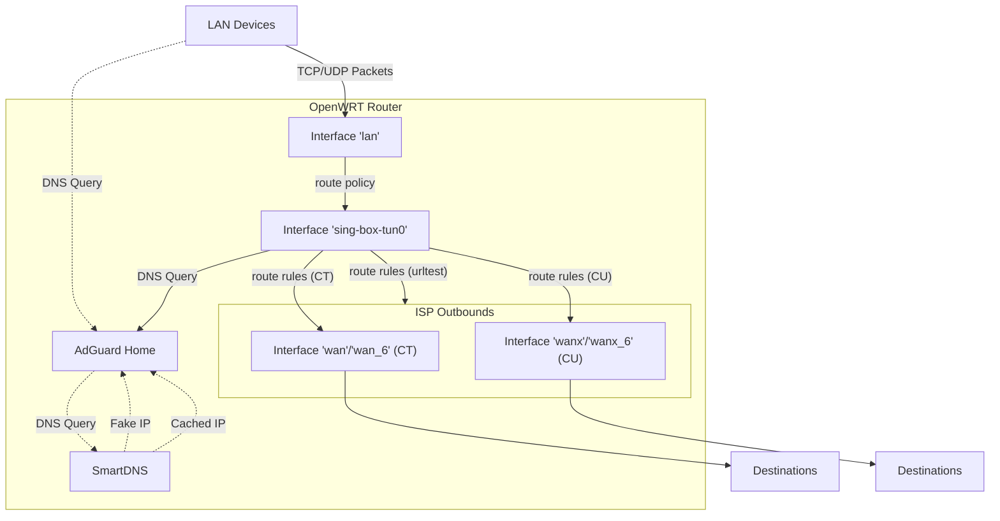

# Multiple WANs

My OpenWrt config for dual ISPs

## Notes

1. 没有利用 `mwan3` 进行负载均衡
2. wan0 和 wan1 都是正常连接
   - IPv6 使用了 NAT66
3. 通过 `sing-box` 来深度定制负载均衡的策略

- [浅谈在代理环境中的 DNS 解析行为](https://blog.skk.moe/post/what-happend-to-dns-in-proxy/)
- [重新思考浏览器输入了 URL 并按下回车之后到底发生了什么——本地 DNS 部分](https://nova.moe/rethink-type-url-dns/)
- [就是要你懂 DNS--一文搞懂域名解析相关问题](https://plantegg.github.io/2019/06/09/%E4%B8%80%E6%96%87%E6%90%9E%E6%87%82%E5%9F%9F%E5%90%8D%E8%A7%A3%E6%9E%90%E7%9B%B8%E5%85%B3%E9%97%AE%E9%A2%98/)
- [OpenWRT Docs: DNS hijacking](https://openwrt.org/docs/guide-user/firewall/fw3_configurations/intercept_dns)

## Diagram

- solid `--` line : TCP/UDP Packets (Layer 4)
- dotted `-.-` line : DNS Query / Protocols (Layer 7)
